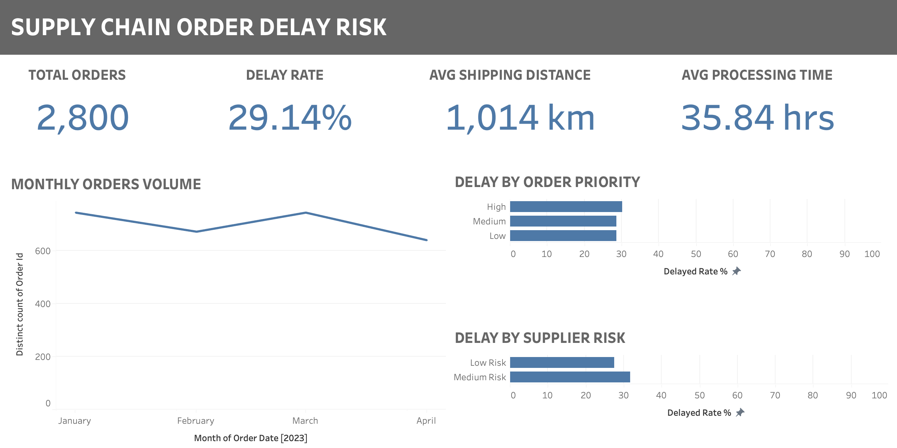

# Supply Chain Order Delay Risk

This project simulates a **materials planning analytics workflow** by identifying order delay risk drivers and generating dashboard-ready tables for reporting and decision support.

It demonstrates how **Python automation and data visualization** can support supply chain and materials planning operations.

---

## Project Overview

In materials planning, delays can arise from factors such as supplier reliability, inventory shortages, processing times, and shipping distances.

This project:
- Automates data preparation using Python
- Classifies supplier, inventory, and operational risk
- Calculates key planning KPIs
- Generates structured output tables for dashboards
- Visualizes delay risk patterns in Tableau

---

## Dashboard Preview



---

## Key KPIs Generated

The script produces materials planning metrics, including:

- Total orders
- Delay rate (%)
- Inventory risk (%)
- Processing risk (%)
- Distance risk (%)
- Average processing time
- Average shipping distance

Breakdown tables:
- Delay by order priority
- Delay by supplier risk
- Delay by shipping method

---

## Tech Stack

- Python
- pandas
- numpy
- Tableau

---

## How to Run the Project

Make sure the dataset CSV file is located **in the same folder as the Python script**.

Install dependencies:

```bash
pip install pandas numpy

